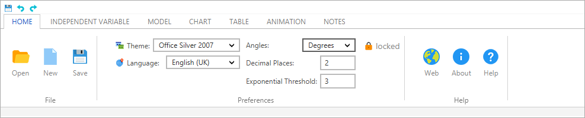

# FXRibbon
Ribbon control for Java, using JavaFX framework, based on [Microsoft Ribbon](https://en.wikipedia.org/wiki/Ribbon_(computing)).

## Issues and Contributions
Issues can be reported to the Issue tracker. If you're not sponsoring or fixing them yourself, please be patiente as I can only work on them during my spare time and according to priorities.  
We welcome contributions, they can be submitted via Pull requests.

## Pull Requests (PR)
We welcome contributions via PR.  
Before submitting a PR please, please file an issue for prior discussion. This will avoid you wasting time with a PR that
might not be approved because for instance might be outside the intended scope of the project.

## Controls used inside Ribbon
The controls used inside the ribbon (e.g. comboboxs, texfield, etc)  are based on JMetro.
For now the option has been to, for the most commonly used controls inside the ribbon, have these styles available through this library and so avoid another dependency for most use cases. 

## Icons used on test apps
Kudos icons8 for the icons used in the sample apps, visit [https://icons8.com](https://icons8.com) for more information.

# License
FXRibbon uses the [new BSD](http://en.wikipedia.org/wiki/BSD_licenses#3-clause_license_.28.22Revised_BSD_License.22.2C_.22New_BSD_License.22.2C_or_.22Modified_BSD_License.22.29) license 
